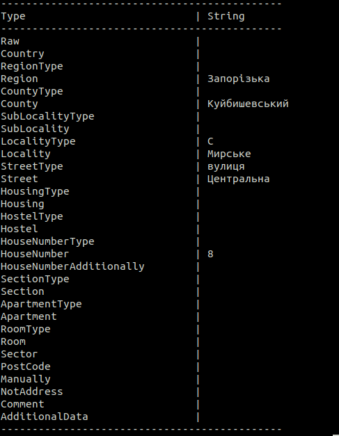
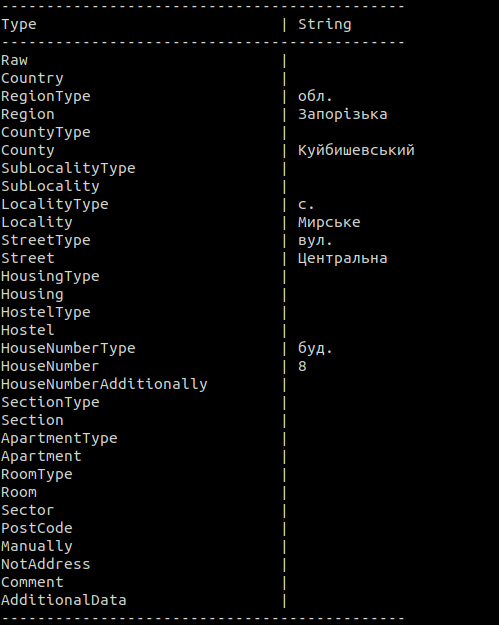

# UAddressFormat

# Description
[](https://badge.fury.io/py/uaddressformat)

Correction of address types for reference. Library module [uaddress](https://github.com/martinjack/uaddress). 

> Read this in other language: [English](README.en.md), [Русский](README.md), [Український](README.ua.md)

# Requirements
* python3
* uaddress

# Install
```shell
pip3 install uaddressformat
```
# Install local
```shell
python3 setup.py install --user
```

# Examples
```shell
python3 example.py
```
 

# Methods
### clearTrash
* `str`: String
### RegionType
* `str`: String
* `region`: String
### Locality
* `type`: String
* `name`: String
### Street
* `str`: String
* `type`: Boolean
### StreetType
* `str`: String
### Housing
* `str`: String
* `type`: Boolean
### HouseNumberType
* `str`: String
* `house`: String
### HouseNumber
* `str`: String
* `additionally`: String
### HouseNumberAdditionally
* `number`: String
* `sub`: String
### ApartmentType
* `str`: String
* `type`: Boolean