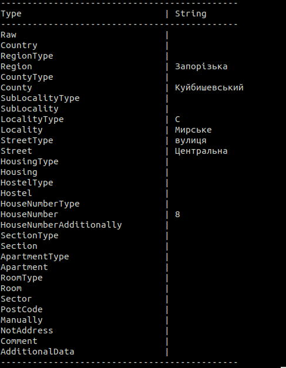
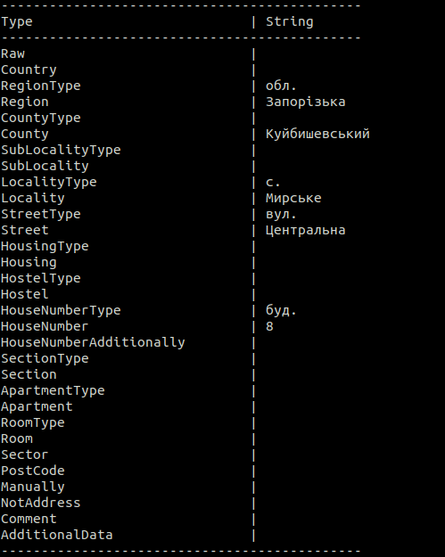

# UAddressFormat

# Опис
[](https://badge.fury.io/py/uaddressformat)

Виправлення типів адреси на стандартні. Модуль для бібліотеки [uaddress](https://github.com/RapidappsIT/uaddress). 

> Read this in other language: [English](README.en.md), [Русский](README.md), [Український](README.ua.md)

# Вимоги
* python3
* uaddress

# Встановлення
```shell
pip3 install uaddressformat
```
# Встановлення локально
```shell
python3 setup.py install --user
```

# Приклад
```shell
python3 example.py
```
 

# Методи
### clearTrash
* `str`: String
### RegionType
* `str`: String
* `region`: String
### Locality
* `type`: String
* `name`: String
### Street
* `str`: String
* `type`: Boolean
### StreetType
* `str`: String
### Housing
* `str`: String
* `type`: Boolean
### EntranceType
* `str`: String
* `type`: Boolean
### HouseNumberType
* `str`: String
* `house`: String
### HouseNumber
* `str`: String
* `additionally`: String
### HouseNumberAdditionally
* `number`: String
* `sub`: String
### ApartmentType
* `str`: String
* `type`: Boolean